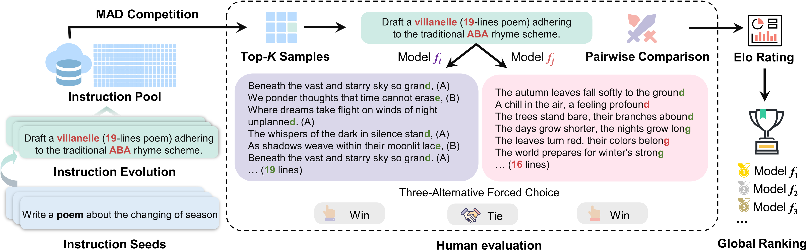

# Sample-Efficient Human Evaluation of LLMs via MAD Competition
This is the official repository for our paper: [[2404.08008] Sample-Efficient Human Evaluation of Large Language Models via Maximum Discrepancy Competition (arxiv.org)](https://arxiv.org/abs/2404.08008).


## Table of contents
- <a href='#instroduction'>Introduction</a>
- <a href='#Quick-Start'>Quick Start</a>
    - <a href='#setup'>Setup</a>
    - <a href='#usage'>Usage</a>
        - <a href='#step-1'>Step 1: Instruction Evolution</a>
        - <a href='#step-2'>Step 2: Model Inference</a>
        - <a href='#step-3'>Step 3: Similarity measurement</a>
        - <a href='#step-4'>Step 4: MAD competition</a>
        - <a href='#step-5'>Step 5: Human Preference Annotation</a>
        - <a href='#step-6'>Step 6: Elo Ranking</a>


## Introduction <a id='introduction'></a>
The past years have witnessed a proliferation of large language models (LLMs). Yet, automated and unbiased evaluation of LLMs is challenging due to the inaccuracy of standard metrics in reflecting human preferences and the inefficiency in sampling informative and diverse test examples.
While human evaluation remains the gold standard, it is expensive and time-consuming, especially when dealing with a large number of testing samples. 

We introduce a labor-saving evaluation approach by an *automated*, *adaptive* and *sample-efficient* mechanism based on **MA**ximum **D**iscrepancy (MAD) competition to select testing samples. Our approach draws inspiration from the principle of "Model Falsification as Model Comparison", that is, to automatically identify a minimum set of samples that are most likely to serve as counterexamples for falsifying an LLM, where higher difficulty in falsification indicates the superiority of the LLM.




MAD automatically selects a small set of informative and diverse instructions, each adapted to two LLMs, whose responses are subject to three-alternative forced choice by human subjects. The pairwise comparison results are then aggregated into a global ranking using the Elo rating system. 

## Quick Start <a id='Quick-Start'></a>
### Setup <a id="setup"></a>
We use `python 3.10.9` in this project. You can create a virtual environment using the following command:
```shell
conda create -n YOUR_ENV_NAME python=3.10.9 -y
```
Next, we need to install all Python libraries listed in `requirements.txt`. Make sure the versions are correct:
```shell
pip install -r requirements.txt
```

### Usage <a id="usage"></a>
Our method consists of the following 6 steps:
1) Start from instruction seeds and generate new instructions through the instruction evolution method, resulting in an Instruction Pool.
2) Select multiple models and collect their responses to the instruction pool.
3) Compute the similarity between responses generated by pairs of models for the same instruction.
4) Use MAD competition to select the Top-K instructions.
5) Manual preference labeling.
6) Rank using the Elo Rating System.

If you want to skip steps 1 to 2 and explore using existing data, you can refer to our experimental process with `Chatbot Arena conversations` [data](https://huggingface.co/datasets/lmsys/chatbot_arena_conversations) and jump to <a href='#step3'>step 3</a>.

#### Step 1: Instruction Evolution <a id="step-1"></a>
You can run `instruction_evol.py` with the following command to generate instructions, taking the `Writing` scenario as an example:
```shell
# The avaliable scenario: Understanding, Reasoning, Writing, Coding
dataset_name=Writing   
# The LLM that generate new instruction
model=gpt-4-1106-preview  # avaliable model: gpt-3.5 or gpt-4
output_path=./data/instruction/${dataset_name}.jsonl
max_tokens=2048
temperature=0.7
top_p=0.9
# The number of evolution iterations
iter=1

export OPENAI_API_KEY='Your OpenAI API KEY'
python instruction_evol.py \
  --dataset_name ${dataset_name} \
  --output_path ${output_path} \
  --model ${model} \
  --max_tokens ${max_tokens} \
  --temperature ${temperature} \
  --top_p ${top_p} \
  --iter ${iter} \
  --api_batch 200 \
```
We can directly generate instructions by modifying `./scripts/instruction_evol.sh` and then running:
```shell
bash ./scripts/instruction_evol.sh
```
The data will be saved in the `./data/instruction` directory.

#### Step 2: Model Inference <a id="step-2"></a>
For API-type models, model inference can be performed by modifying the command in `vllm_api_infernece.sh`, taking the `Writing` scenario as an example:
```shell
# The inference model, default model used in paper:
MODEL_NAME=gpt-3.5-turbo-1106
MAX_TOKENS=2048
DEV_SET=Writing    # Reasoning,Writing,Understanding,Coding,Chatbot_Arena
GEN_OUTPUT_PATH=./outputs/inference/

# For gpt-3.5-turbo and gpt-4-turbo
export OPENAI_API_KEY='Your OpenAI API KEY'
# For gemini-pro
export GOOGLE_API_KEY='Your GOOGLE API KEY'

python vllm_api_inference.py \
    --model_name ${MODEL_NAME} \
    --max_tokens ${MAX_TOKENS} \
    --temperature 0.0 \
    --output_file_name ${GEN_OUTPUT_PATH} \
    --dev_set ${DEV_SET} \
    --sample_num -1 \
    --api_batch 100 \
```
Code supports various chat models from OpenAI, Gemini-Pro, and locally deployed models based on the [vLLM API](https://github.com/vllm-project/vllm).

For locally deployed non-API models, we utilize the vLLM framework for inference, as detailed in `vllm_inference.sh`.
Therefore, we execute the following commands:
```shell
bash ./scripts/vllm_api_inference.sh
```
or
```shell
bash ./scripts/vllm_inference.sh
```

#### Step 3: Similarity measurement <a id="step-3"></a>
We employ three similarity metrics: GPT-4, text-embedding-ada-002 (OpenAI), and Bert-Score. We configure the relevant parameters for evaluating similarity using the following command:
```shell
DEV_SET=Writing
# The models needs to be evaluated. Using ',' to split
# models in paper: qwen-14b,vicuna-13b,wizardlm-13b,chatglm3-6b,gpt-4-1106-preview,gpt-3.5-turbo-1106,openchat-3.5,gemini-pro
EVAL_MODELS=chatglm3-6b,gpt-3.5-turbo-1106,...
# 3 metrics: gpt-4-1106-preview, bert-score, text-embedding-ada-002
model=text-embedding-ada-002
gen_prompt_type=gpt-4-eval     # The prompt for gpt-4 metric
max_tokens=1024
temperature=0.0
sample_num=-1
output_path=./outputs/eval/${model}

# For gpt-4 metric
export OPENAI_API_KEY='Your OpenAI API KEY'
CUDA_VISIBLE_DEVICES=0,1 python similarity_check.py \
    --gen_prompt_type ${gen_prompt_type} \
    --dev_set ${DEV_SET} \
    --eval_models ${EVAL_MODELS} \
    --model ${model} \
    --max_tokens ${max_tokens} \
    --temperature ${temperature} \
    --sample_num ${sample_num} \
    --output_path ${output_path} \
    --api_batch 200 \
```

<a id="step3"></a>
> For Chatbot_Arena, set `DEV_SET=chatbot_arena`.

#### Step 4: MAD competition <a id="step-4"></a>
Once the scenario, MAD metric, and Top-K values are chosen, we can obtain the data with the greatest differences selected through the MAD competition.
```shell
bash ./scripts/mad_competition.sh
```

#### Step 5: Human Preference Annotation <a id="step-5"></a>
Before human preference annotation, the format of a data should be as follows:
```python
{
    "instruction": "xxx", 
    "input": "", 
    "output": "", 
    "response_1": "model_1 response", 
    "response_2": "model_2 response",
    "score": "similarity score",
    "source": "file name, e.g., model_1-vs-model_2.jsonl"
}
```
During the annotation process, the annotated result should be the name of the winning model or 'tie'. After obtaining the manually annotated result, it should be placed in the `output` field as follows:

```python
"instruction": "xxx", 
"input": "", 
"output": "winner name or tie", 
...
```

Finally, we can unify the results using the following code and save them in a JSON file. Taking `chatbot_arena` as an example:

```python
eval_model = 'text-embedding-ada-002'
domain = 'chatbot_arena'

f = open(f'./outputs/MAD/{eval_model}/{domain}.jsonl', 'r')
save_f = open(f'./outputs/annotation/{eval_model}/{domain}.jsonl', 'w')
    
total_data = [json.loads(line) for line in f.readlines()]       # The MAD selected data
# we save the human annotation of chatbot arena in `output`

save_dict_list = []
for i, d in enumerate(total_data):
    model_a, model_b = d['source'].replace(f'.jsonl', '').split('-vs-')
    responses = [(model_a, d['response_1']), (model_b, d['response_2'])]
    random.shuffle(responses)

    if d['output'] == responses[0][0]:
        winner = 'model_a'
    elif d['output'] == responses[1][0]:
        winner = 'model_b'
    else:
        winner = 'tie'
    
    dt = datetime.now()
    save_dict = {
        'model_a': responses[0][0],
        'model_b': responses[1][0],
        'winner': winner,
        'judge': 'arena_user',
        'turn': 1,
        'anony': True,
        'language': 'English',
        'tstamp': dt.timestamp(),
        'source': d['source'],
        'data': {
            'instruction': d['instruction'],
            'input': d['input'],
            'output': d['output'],
            'response_1': responses[0][1],
            'response_2': responses[1][1],
            'score': float(d['score']),
            'explanation': d['explanation']
        }
    }
    if domain in ['Reasoning', 'Understanding', 'Coding']:
        save_dict['data']['answer'] = d['answer']
    save_dict_list.append(save_dict)

json.dump(save_dict_list, save_f, indent=4, ensure_ascii=False)
save_f.close()
```

#### Step 6: Elo Ranking <a id="step-6"></a>
Please refer to the `Elo_Ranking.ipynb`. The `Elo_Ranking.ipynb` file provides sample code for calculating the Elo Ranking Score, inspired by the [strategy for calculating Elo Rating in Chatbot Arena](https://colab.research.google.com/drive/1RAWb22-PFNI-X1gPVzc927SGUdfr6nsR). In the calculation, we use the bootstrap method to obtain more stable rankings.

## Citation
Please cite the repo or the paper if they are helpful to you.
```
@misc{feng2024sampleefficient,
      title={Sample-Efficient Human Evaluation of Large Language Models via Maximum Discrepancy Competition}, 
      author={Kehua Feng and Keyan Ding and Kede Ma and Zhihua Wang and Qiang Zhang and Huajun Chen},
      year={2024},
      eprint={2404.08008},
      archivePrefix={arXiv},
      primaryClass={cs.LG}
}
```