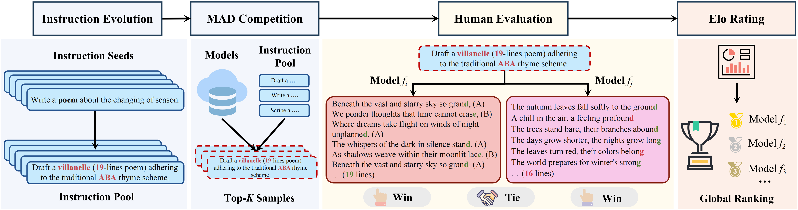

<h1 align="center">
🚀 Sample-Efficient Human Evaluation of LLMs via<br>Maximum Discrepancy Competition
</h1>

This is the official repository for our paper: 🚀[Sample-Efficient Human Evaluation of Large Language Models via Maximum Discrepancy Competition](https://arxiv.org/abs/2404.08008).

---

## 🔥 News

- **2025.02** &nbsp;🎉🎉&nbsp; Our paper is accepted at **ACL 2025**!
- **2024.04** &nbsp;📝📝&nbsp; We release a preprint on [arXiv](https://arxiv.org/abs/2404.08008).


## 🗂️ Table of Contents

* [📖 Introduction](#introduction)
* [⚡ Quick Start](#quick-start)

  * [⚙️ Setup](#setup)
  * [▶️ Usage](#usage)

    * [🌱 Step 1: Instruction Evolution](#step-1)
    * [🤖 Step 2: Model Inference](#step-2)
    * [🔍 Step 3: Similarity measurement](#step-3)
    * [🏆 Step 4: MAD competition](#step-4)
    * [📝 Step 5: Human Preference Annotation](#step-5)
    * [📊 Step 6: Elo Ranking](#step-6)

---

## 📖 Introduction <a id='introduction'></a>

The past years have witnessed a proliferation of large language models (LLMs). Yet, automated and unbiased evaluation of LLMs is challenging due to the inaccuracy of standard metrics in reflecting human preferences and the inefficiency in sampling informative and diverse test examples.
While human evaluation remains the gold standard, it is expensive and time-consuming, especially when dealing with a large number of testing samples.

We introduce a labor-saving evaluation approach by an *automated* 🤖, *adaptive* 🔄 and *sample-efficient* 💡 mechanism based on **MA**ximum **D**iscrepancy (MAD) competition to select testing samples. Our approach draws inspiration from the principle of "Model Falsification as Model Comparison" 🧪, that is, to automatically identify a minimum set of samples that are most likely to serve as counterexamples for falsifying an LLM, where higher difficulty in falsification indicates the superiority of the LLM.

<p align="center">
  
</p>

MAD automatically selects a small set of informative and diverse instructions, each adapted to two LLMs, whose responses are subject to three-alternative forced choice by human subjects. The pairwise comparison results are then aggregated into a global ranking using the Elo rating system.

---

## ⚡ Quick Start <a id='quick-start'></a>

### ⚙️ Setup <a id="setup"></a>

We use `python 3.10.9` in this project. You can create a virtual environment using the following command:

```shell
conda create -n YOUR_ENV_NAME python=3.10.9 -y
```

Next, install all Python libraries listed in `requirements.txt`. Make sure the versions are correct:

```shell
pip install -r requirements.txt
```

---

### ▶️ Usage <a id="usage"></a>

Our method consists of the following **6 steps**:

1) 1️⃣ **Start from instruction seeds** and generate new instructions through the instruction evolution method, resulting in an Instruction Pool.
2) 2️⃣ **Select multiple models** and collect their responses to the instruction pool.
3) 3️⃣ **Compute the similarity** between responses generated by pairs of models for the same instruction.
4) 4️⃣ **Use MAD competition** to select the Top-K instructions.
5) 5️⃣ **Manual preference labeling**.
6) 6️⃣ **Rank using the Elo Rating System**.

If you want to skip steps 1 to 2 and explore using existing data, you can refer to our experimental process with `Chatbot Arena conversations` [data](https://huggingface.co/datasets/lmsys/chatbot_arena_conversations) and jump to [Step 3](#step3).

---

#### 🌱 Step 1: Instruction Evolution <a id="step-1"></a>

You can run `instruction_evol.py` with the following command to generate instructions, taking the `Writing` scenario as an example:

```shell
# The avaliable scenario: Understanding, Reasoning, Writing, Coding
dataset_name=Writing
# The LLM that generate new instruction
model=gpt-4-1106-preview  # avaliable model: gpt-3.5 or gpt-4
output_path=./data/instruction/${dataset_name}.jsonl
max_tokens=2048
temperature=0.7
top_p=0.9
# The number of evolution iterations
iter=1

export OPENAI_API_KEY='Your OpenAI API KEY'
python instruction_evol.py \
  --dataset_name ${dataset_name} \
  --output_path ${output_path} \
  --model ${model} \
  --max_tokens ${max_tokens} \
  --temperature ${temperature} \
  --top_p ${top_p} \
  --iter ${iter} \
  --api_batch 200 \
```

You can also modify `./scripts/instruction_evol.sh` and then run:

```shell
bash ./scripts/instruction_evol.sh
```

The data will be saved in the `./data/instruction` directory.

---

#### 🤖 Step 2: Model Inference <a id="step-2"></a>

For API-type models, model inference can be performed by modifying the command in `vllm_api_infernece.sh`, taking the `Writing` scenario as an example:

```shell
# The inference model, default model used in paper:
MODEL_NAME=gpt-3.5-turbo-1106
MAX_TOKENS=2048
DEV_SET=Writing    # Reasoning,Writing,Understanding,Coding,Chatbot_Arena
GEN_OUTPUT_PATH=./outputs/inference/

# For gpt-3.5-turbo and gpt-4-turbo
export OPENAI_API_KEY='Your OpenAI API KEY'
# For gemini-pro
export GOOGLE_API_KEY='Your GOOGLE API KEY'

python vllm_api_inference.py \
    --model_name ${MODEL_NAME} \
    --max_tokens ${MAX_TOKENS} \
    --temperature 0.0 \
    --output_file_name ${GEN_OUTPUT_PATH} \
    --dev_set ${DEV_SET} \
    --sample_num -1 \
    --api_batch 100 \
```

Supports OpenAI, Gemini-Pro, and [vLLM API](https://github.com/vllm-project/vllm) models.

For local models, see `vllm_inference.sh`:

```shell
bash ./scripts/vllm_api_inference.sh
# or
bash ./scripts/vllm_inference.sh
```

---

#### 🔍 Step 3: Similarity measurement <a id="step-3"></a>

We employ three similarity metrics: GPT-4, text-embedding-ada-002 (OpenAI), and Bert-Score. Use the following command to evaluate similarity:

```shell
DEV_SET=Writing
# The models needs to be evaluated. Using ',' to split
# models in paper: qwen-14b,vicuna-13b,wizardlm-13b,chatglm3-6b,gpt-4-1106-preview,gpt-3.5-turbo-1106,openchat-3.5,gemini-pro
EVAL_MODELS=chatglm3-6b,gpt-3.5-turbo-1106,...
# 3 metrics: gpt-4-1106-preview, bert-score, text-embedding-ada-002
model=text-embedding-ada-002
gen_prompt_type=gpt-4-eval
max_tokens=1024
temperature=0.0
sample_num=-1
output_path=./outputs/eval/${model}

# For gpt-4 metric
export OPENAI_API_KEY='Your OpenAI API KEY'
CUDA_VISIBLE_DEVICES=0,1 python similarity_check.py \
    --gen_prompt_type ${gen_prompt_type} \
    --dev_set ${DEV_SET} \
    --eval_models ${EVAL_MODELS} \
    --model ${model} \
    --max_tokens ${max_tokens} \
    --temperature ${temperature} \
    --sample_num ${sample_num} \
    --output_path ${output_path} \
    --api_batch 200 \
```

<a id="step3"></a>

> 💡 For Chatbot\_Arena, set `DEV_SET=chatbot_arena`.

---

#### 🏆 Step 4: MAD competition <a id="step-4"></a>

Once the scenario, MAD metric, and Top-K values are chosen, select the most informative data:

```shell
bash ./scripts/mad_competition.sh
```

---

#### 📝 Step 5: Human Preference Annotation <a id="step-5"></a>

Before annotation, the data format should be:

```python
{
    "instruction": "xxx",
    "input": "",
    "output": "",
    "response_1": "model_1 response",
    "response_2": "model_2 response",
    "score": "similarity score",
    "source": "file name, e.g., model_1-vs-model_2.jsonl"
}
```

During annotation, the result should be the winner model or 'tie'. After annotation, put it in the `output` field:

```python
"instruction": "xxx",
"input": "",
"output": "winner name or tie",
...
```

Unify and save the results in JSON format, e.g., for `chatbot_arena`:

```python
eval_model = 'text-embedding-ada-002'
domain = 'chatbot_arena'
# ...
json.dump(save_dict_list, save_f, indent=4, ensure_ascii=False)
```

---

#### 📊 Step 6: Elo Ranking <a id="step-6"></a>

See `Elo_Ranking.ipynb` 📓 for the Elo calculation, following the [Chatbot Arena Elo strategy](https://colab.research.google.com/drive/1RAWb22-PFNI-X1gPVzc927SGUdfr6nsR).
Bootstrap is used for stable rankings.

---

## 📚 Citation

Please cite the repo or the paper if they are helpful to you:

```bibtex
@misc{feng2024sampleefficient,
      title={Sample-Efficient Human Evaluation of Large Language Models via Maximum Discrepancy Competition},
      author={Kehua Feng and Keyan Ding and Kede Ma and Zhihua Wang and Qiang Zhang and Huajun Chen},
      year={2024},
      eprint={2404.08008},
      archivePrefix={arXiv},
      primaryClass={cs.LG}
}
```